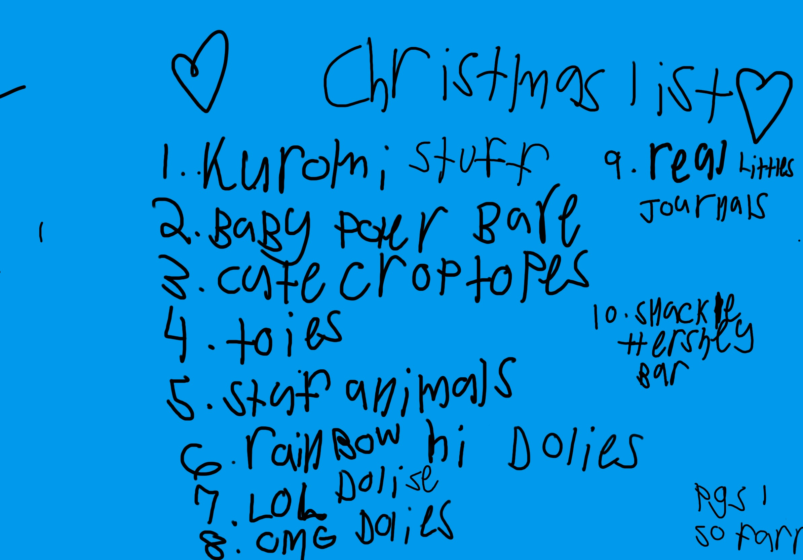
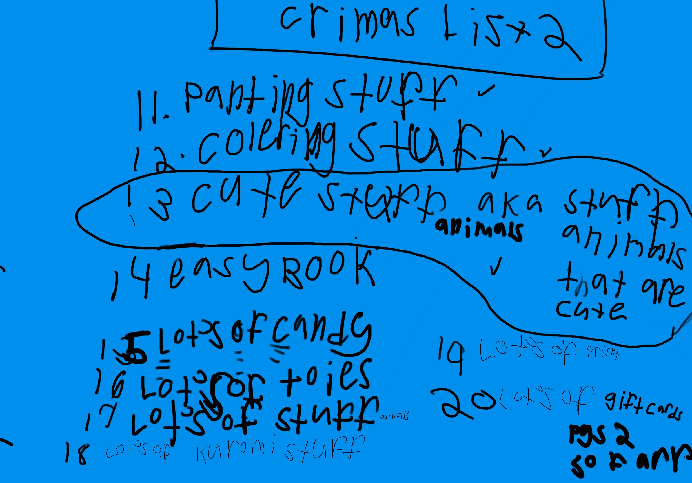

 **Gift Ideas for Elise**

Sleeping Stitch - miniso

-  [Kuromi](https://www.sanrio.com/collections/kuromi){:target="\_blank"} stuff (let us know if you would like suggestions)
-  [IKEA - SNUTTIG polar bear soft toy](https://www.ikea.com/us/en/p/snuttig-soft-toy-polar-bear-white-30298103/){:target="\_blank"} |
  $25
- Cute crop tops
- Toys
- Stuffed animals
- Rainbow High dolls (especially [Rainbow High Color & Create DIY Fashion Doll - Blue Eyes/Straight Hair](https://www.target.com/p/rainbow-high-color-38-create-diy-fashion-doll-blue-eyes-straight-hair/-/A-88084809){:target="\_blank"})
- LOL dolls
- OMG dolls
-  [REAL LITTLES Disney Collectible Micro Journal](https://www.amazon.com/REAL-LITTLES-Disney-S5-Journal/dp/B0BQNDYF9S/){:target="\_blank"} |
  $10
- Painting stuff
- Coloring stuff
- Cute stuff (AKA stuffed animals that are cute)
- Easy book(s)
- Lots of candy
-  Apple or Target gift cards

**Elise's Hand Written Christmas List**

Page 1 

Page 2 

<!--
-  [ItemName](link){:target="_blank"} |
$price
-->

##### [back](readme.md)

 
